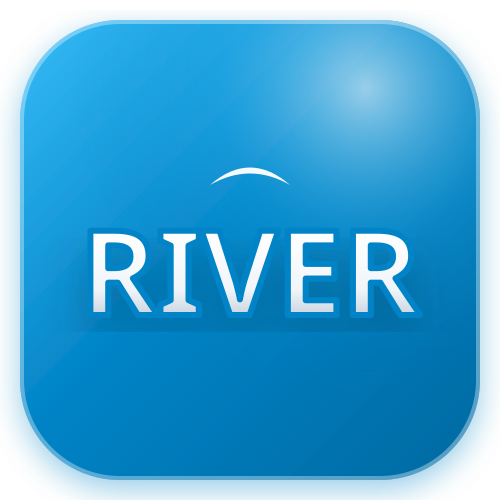
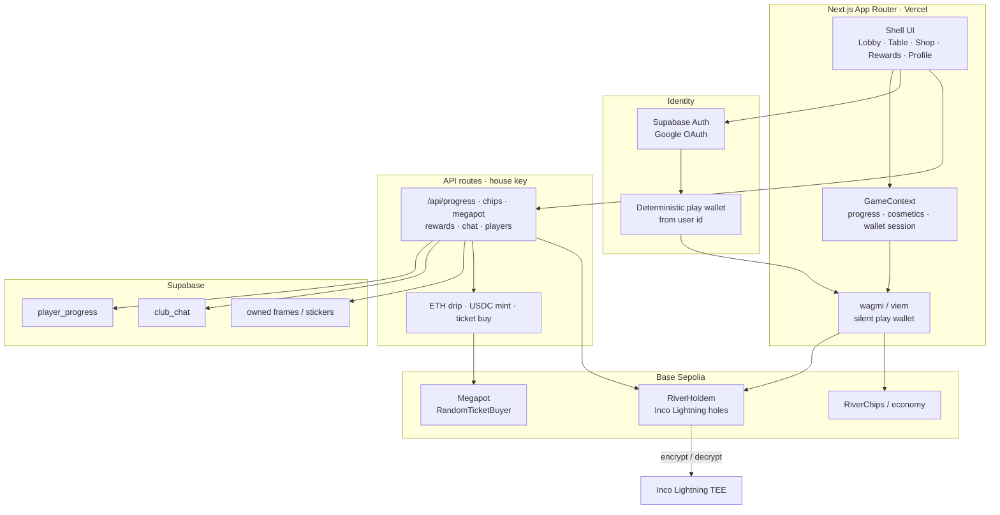
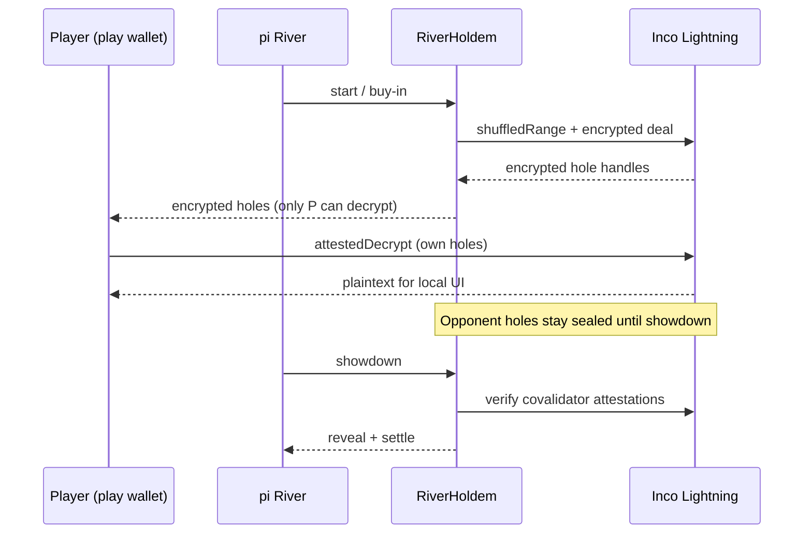
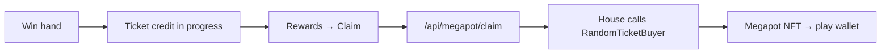

<p align="center">
  
</p>

<h1 align="center">pi River</h1>

<p align="center">
  
  &nbsp;
  <strong>Confidential Texas Hold’em on Inco Lightning + Megapot Sealed River</strong>
</p>

<p align="center">
  <a href="https://pi.sithunyein.com"></a>
  <a href="https://github.com/thesithunyein/pi-river"></a>
  <a href="https://docs.inco.org"></a>
  <a href="https://docs.megapot.io"></a>
</p>

<p align="center">
  
</p>

**pi River** is a production-style heads-up poker product: Google sign-in, silent Base Sepolia play wallets, **Inco-encrypted hole cards**, fun-chip progression, cosmetics shop, club chat, and real **Megapot** ticket claims — one live URL for both jam tracks.

| | |
|---|---|
| **Live app** | https://pi.sithunyein.com |
| **Mirror** | https://mi.sithunyein.com |
| **Network** | Base Sepolia (`84532`) |
| **Jam** | Inco × Megapot Summer Game Jam (submit once per track) |

---

## Product snapshot

| Surface | What players get |
|---|---|
| **Table** | Heads-up Hold’em vs bot / friends · buy-in on-chain · encrypted holes until sealed showdown |
| **Inco** | `shuffledRange` deal · player-only `attestedDecrypt` · covalidator-backed reveal |
| **Megapot** | Ticket credits on wins · house-minted NFT via `JackpotRandomTicketBuyer` (`source=pi-river`) |
| **Progress** | Daily bonus (UTC once/day) · missions · achievements · durable cloud sync (Supabase) |
| **Shop** | Frames & stickers · chip packs (on-chain deposit → credit) |
| **Social** | Live club chat · ladder presence · friend challenges · public profiles |

---

## Architecture



### Hand privacy loop (Inco)



### Megapot claim loop



---

## Judge paths (≤90s)

### Inco track
1. Open **Live** → Google sign-in  
2. **Play vs Bot** — fold / check with **zero MetaMask** (silent play wallet)  
3. Watch **Inco · encrypted holes** until sealed showdown reveal  

### Megapot track
1. Win a hand → toast / overlay credits a **Megapot ticket**  
2. **Rewards** → **Claim Megapot ticket**  
3. House mints a real Megapot NFT to the play wallet on Base Sepolia  

---

## Tech stack

| Layer | Choice |
|---|---|
| App | Next.js 15 · React 19 · TypeScript · Tailwind |
| Chain | Base Sepolia · viem · wagmi |
| Privacy | Inco Lightning (`@inco/lightning-js`) |
| Jackpot | Megapot Sealed River buyer contracts |
| Auth / DB | Supabase (Google + `player_progress` + chat) |
| Contracts | Foundry (`contracts/`) |
| Deploy | Vercel |

---

## Repository structure

```text
pi-river/
├── public/
│   ├── logo.svg                 # App logo (hero / README)
│   ├── brand/
│   │   ├── shield-icon.svg      # Product shield mark
│   │   ├── mi-mark.svg          # Wordmark tile
│   │   ├── mi-logo.svg
│   │   └── …
│   ├── frames/                  # Avatar ornate frames
│   ├── stickers/                # Shop / chat stickers
│   └── audio/
├── src/
│   ├── app/
│   │   ├── (shell)/             # Lobby, table, shop, rewards, profile
│   │   ├── api/                 # progress, chips, megapot, rewards, chat, …
│   │   └── auth/                # OAuth callbacks
│   ├── components/              # Table UI, shop, chat, overlays
│   ├── context/GameContext.tsx  # Client game + progress state
│   ├── hooks/                   # Ladder / seat presence
│   └── lib/
│       ├── inco/                # Encrypt / decrypt helpers
│       ├── megapot/             # Ticket claim client
│       ├── wallet/              # Silent play wallet
│       ├── cloudProgress.ts     # Supabase merge / flush
│       ├── missions.ts
│       ├── frames.ts · stickers.ts
│       └── …
├── contracts/
│   ├── src/
│   │   ├── RiverHoldem.sol      # Confidential Hold’em table
│   │   ├── RiverChips.sol       # Chip economy
│   │   ├── RiverClub.sol
│   │   ├── CardLib.sol · HoldemEval.sol
│   │   └── kit/ConfidentialDeck.sol
│   └── script/                  # Foundry deploys
├── supabase/
│   ├── migrations/              # 001…008 durable progress / shop / daily
│   └── FULL_SETUP.sql           # One-shot paste for empty projects
├── scripts/                     # Asset generators (stickers, crops)
├── package.json
└── README.md
```

---

## Quick start

```bash
bun install
cp .env.example .env.local
# Fill Supabase + contract addresses
# PRIVATE_KEY = house/bot wallet (ETH drip + Megapot USDC mint) — local / Vercel only
bun run dev
```

Optional: apply `supabase/FULL_SETUP.sql` (or migrations `001`–`008`) in the Supabase SQL editor.

### Contracts (Base Sepolia)

| Contract | Notes |
|---|---|
| **RiverHoldem** | `NEXT_PUBLIC_RIVER_HOLDEM_ADDRESS` |
| **Megapot Jackpot** | `0x465dA3c859f193A3807386387bEE941B2A4c3279` |
| **Megapot RandomBuyer** | `0x53c04e7e5044B28Ea8A4F9c4b26E3Ac1aeb63746` |

Fun chips / shop cosmetics are progression. Table buy-in + Megapot tickets are on-chain testnet.

---

## Brand assets

| Asset | Path |
|---|---|
| App logo | [`public/logo.svg`](public/logo.svg) |
| Shield icon | [`public/brand/shield-icon.svg`](public/brand/shield-icon.svg) |
| Mark | [`public/brand/mi-mark.svg`](public/brand/mi-mark.svg) |
| Logo wordmark | [`public/brand/mi-logo.svg`](public/brand/mi-logo.svg) |

---

## Environment

See [`.env.example`](.env.example). Never commit `PRIVATE_KEY` or `.env.local`.

Typical production keys (Vercel):

- `NEXT_PUBLIC_SUPABASE_URL` / `NEXT_PUBLIC_SUPABASE_ANON_KEY`
- `NEXT_PUBLIC_RIVER_HOLDEM_ADDRESS` (+ chips / club if used)
- `PRIVATE_KEY` (house — drip, Megapot mint)
- Base Sepolia RPC URLs

---

## Jam disclosure

Summer Game Jam week (Aug 2026). Dual-track product on **one** URL — submit separately for **Inco** and **Megapot** tracks per Typeform rules.

---

<p align="center">
  
  &nbsp;Built with Inco Lightning · Megapot · Base Sepolia · Supabase · Next.js
</p>
